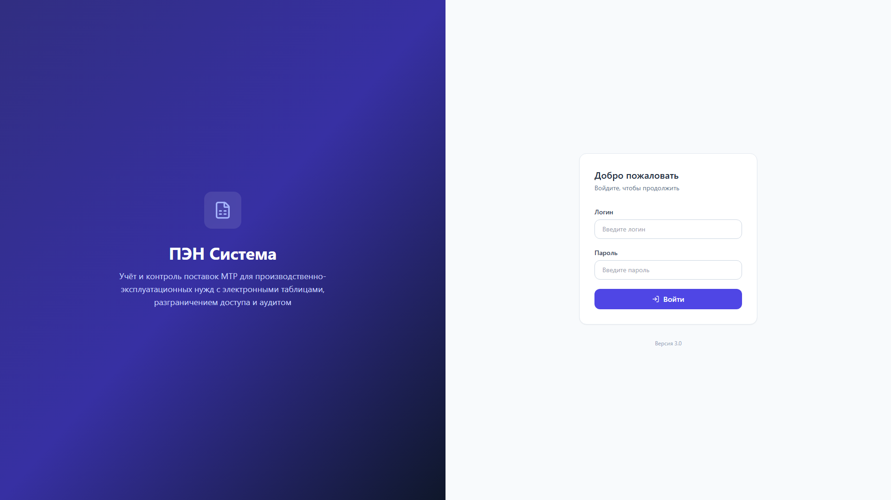
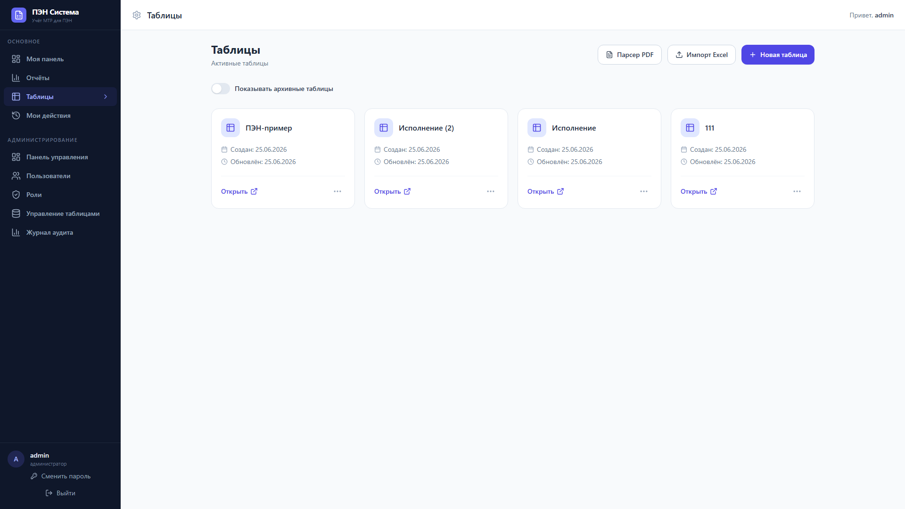
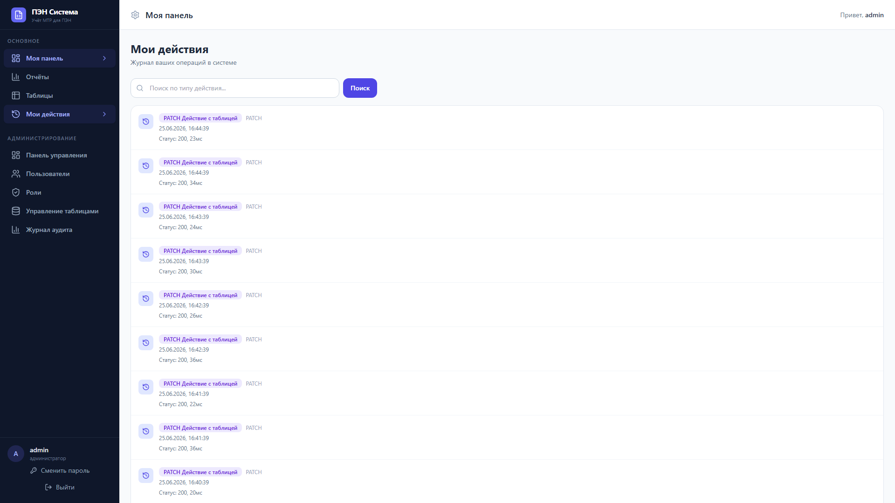
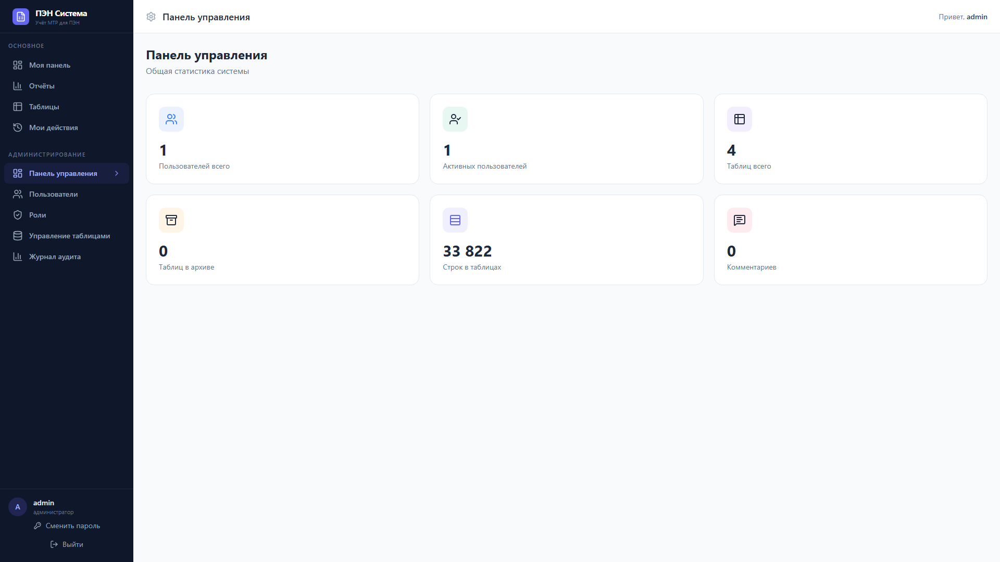
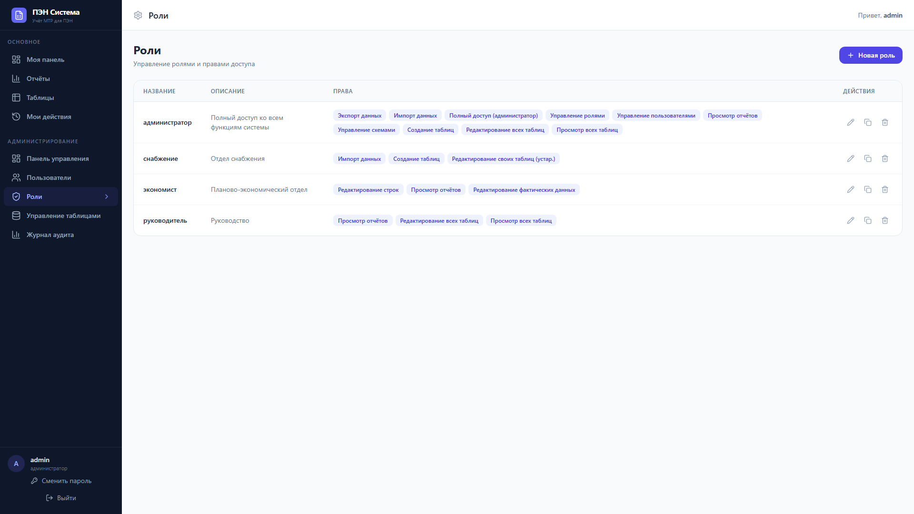
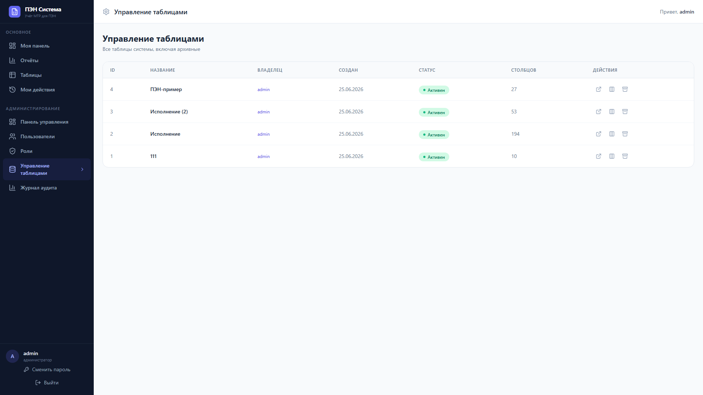
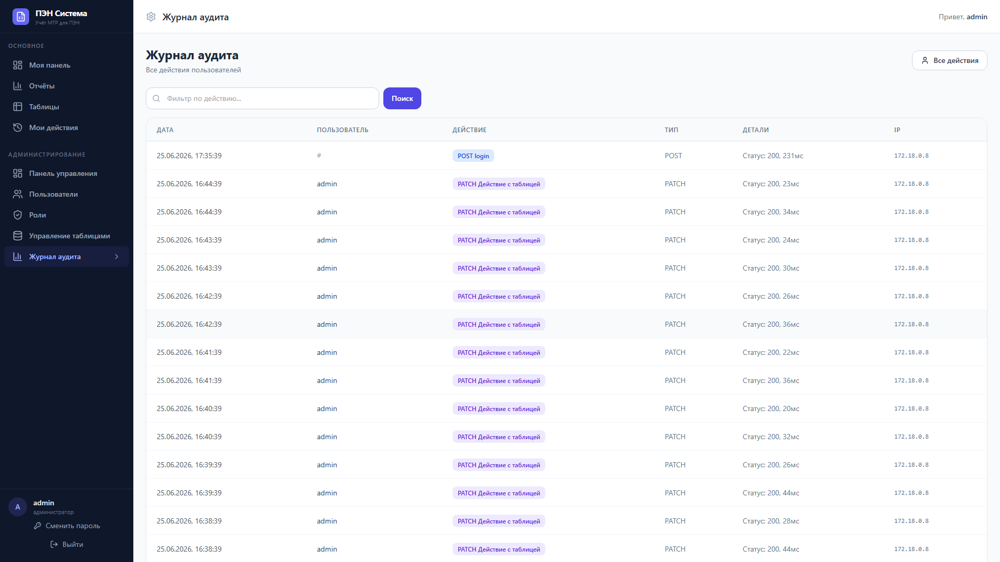
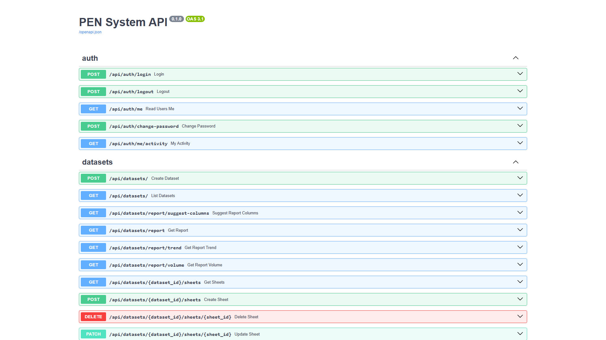
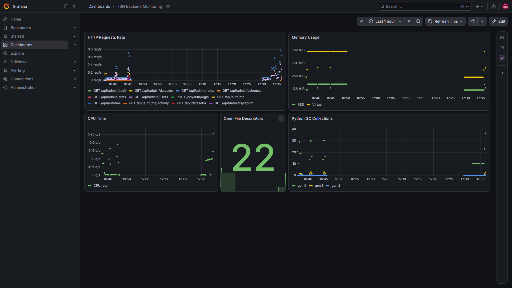
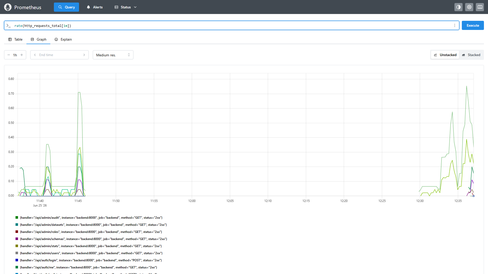

# ПЭН — Система учёта и контроля поставок МТР

**ПЭН (Производственно-Эксплуатационные Нужды)** — корпоративная система для планирования, согласования и контроля поставок материально-технических ресурсов (МТР). Обеспечивает работу с электронными таблицами (план/факт), разграничение доступа, аудит действий, импорт/экспорт Excel и парсинг PDF.

## Стек технологий

| Компонент | Технологии |
|---|---|
| Бэкенд | Python 3.11, FastAPI, SQLAlchemy 2.0, Celery, Redis |
| База данных | PostgreSQL 15 |
| Фронтенд | React 18, TypeScript 5, Vite, Tailwind CSS 3 |
| Табличный редактор | Univer.js — полнофункциональный онлайн-редактор электронных таблиц |
| Мониторинг | Prometheus + Grafana (пре-провиженные дашборды) |
| Прокси | Nginx (HTTP/HTTPS, WebSocket) |
| Инфраструктура | Docker Compose |

## Быстрый старт

```bash
docker-compose up -d
```

- **Фронтенд**: http://localhost
- **API (Swagger)**: http://localhost:8000/docs
- **Grafana**: http://localhost:3000 (логин: admin, пароль из `GRAFANA_PASSWORD` в `.env`)
- **Prometheus**: http://localhost:9090

Учётная запись по умолчанию: **логин:** `admin`, **пароль:** `admin` (если не изменён в `.env`).

## Функциональные возможности

### 📊 Табличный редактор
- Полноценный онлайн-редактор на базе Univer.js
- Поддержка формул (включая русские имена функций: СУММ, СРЗНАЧ, ЕСЛИ и др.)
- Множественные листы в одном датасете
- Стилизация ячеек, объединение ячеек, заморозка строк/столбцов
- Комментарии к ячейкам с тредами и разрешением
- Совместная работа в реальном времени через WebSocket
- Оптимистичная блокировка строк (версионирование)

### 📋 План/Факт анализ
- Сравнение плановых и фактических объёмов/стоимости
- Группировка по категориям материалов, месяцам, подразделениям
- Графики трендов и объёмов (Recharts)
- Экспорт аналитики в PDF

### 🔄 Импорт и экспорт
- **Импорт**: XLSX, XLS, CSV, TSV, ODS — с автоопределением структуры колонок
- **Экспорт в Excel**: с сохранением формул, стилей, объединённых ячеек (асинхронно через Celery)
- **Парсинг PDF**: извлечение табличных данных и числовых значений (включая русские числительные)

### 👥 Управление доступом
- Роли с детальными JSON-разрешениями (admin, снабжение, экономист, руководитель)
- Ограничение видимости строк по роли/отделу/пользователю
- Права редактирования на уровне отдельных колонок
- Массовое создание пользователей через CSV

### 📁 Датасеты
- Создание на основе шаблонов (схем) — переиспользуемые наборы колонок
- Дублирование, архивация (мягкое удаление) и восстановление
- Сохранённые фильтры, сортировки и представления
- Слайсеры — визуальные контролы фильтрации
- Именованные диапазоны для формул
- Полное удаление — только для администратора

### 🔍 Аудит
- Логирование всех действий пользователей (с IP, user-agent)
- Детальная история изменений строк и отдельных ячеек
- Поиск по событиям, пользователям, датам

### 🛡️ Безопасность
- JWT-аутентификация (HS256) с отзывом токенов через Redis
- CSRF-защита (double-submit cookie)
- Rate limiting: 5 запросов/мин на логин
- Проверка MIME-типов загружаемых файлов
- HTTPS (самоподписанные сертификаты)

### 📈 Мониторинг
- Prometheus-метрики по адресу `/metrics`
- Дашборд Grafana с панелями: RPS, память, CPU, файловые дескрипторы, GC Python

## Скриншоты

### Авторизация



### Датасеты



### Редактор таблиц


### Моя активность



### Администрирование



### Управление ролями



### Датасеты в админке



### Аудит



### Swagger-документация



### Мониторинг (Grafana)



### Мониторинг (Prometheus)



## Переменные окружения (.env)

Скопируйте `.env.example` в `.env` и отредактируйте:

| Переменная | Назначение | По умолчанию |
|---|---|---|
| `POSTGRES_USER` / `POSTGRES_PASSWORD` / `POSTGRES_DB` | База данных | pen / pen / pen |
| `SECRET_KEY` | Ключ подписи JWT | — |
| `REDIS_PASSWORD` | Пароль Redis | — |
| `GRAFANA_PASSWORD` | Пароль администратора Grafana | admin |

## API

Swagger-документация автоматически генерируется FastAPI:

- http://localhost:8000/docs (Swagger UI)
- http://localhost:8000/redoc (ReDoc)

Основные эндпоинты:

| Метод | Путь | Назначение |
|---|---|---|
| POST | `/api/auth/login` | Аутентификация |
| GET | `/api/datasets` | Список датасетов |
| POST | `/api/datasets` | Создать датасет |
| GET | `/api/datasets/{id}` | Датасет со строками |
| PUT | `/api/datasets/{id}/rows/{row_id}` | Обновить строку |
| POST | `/api/import-export/import` | Импорт файла |
| GET | `/api/admin/users` | Управление пользователями (admin) |
| GET | `/api/admin/audit` | Лог аудита (admin) |
| GET | `/metrics` | Prometheus-метрики |

## Разработка

### Запуск без Docker

**Бэкенд:**
```bash
cd backend
pip install -r requirements.txt
uvicorn app.main:app --reload --port 8000
```

**Фронтенд:**
```bash
cd frontend
pnpm install
pnpm dev
```

### Миграции БД
```bash
cd backend
alembic upgrade head
```

### Тесты
```bash
# E2E (Playwright)
cd frontend
pnpm exec playwright test
```
