<div align="center">

# ПЭН — Система учёта и контроля поставок МТР

**ПЭН (Производственно-Эксплуатационные Нужды)** — корпоративная система для планирования,
согласования и контроля поставок материально-технических ресурсов:
электронные таблицы план/факт, разграничение доступа, аудит, импорт/экспорт Excel и парсинг PDF.

[](https://www.python.org/)
[](https://fastapi.tiangolo.com/)
[](https://react.dev/)
[](https://www.typescriptlang.org/)
[](https://www.postgresql.org/)
[](https://docs.docker.com/compose/)
[](https://univer.ai/)

[Возможности](#возможности) ·
[Скриншоты](#скриншоты) ·
[Быстрый старт](#быстрый-старт) ·
[API](#api) ·
[Разработка](#разработка)

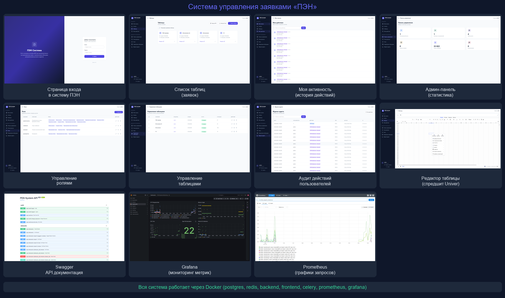

</div>

---

## Содержание

- [Стек технологий](#стек-технологий)
- [Возможности](#возможности)
- [Скриншоты](#скриншоты)
- [Быстрый старт](#быстрый-старт)
- [Структура проекта](#структура-проекта)
- [Переменные окружения](#переменные-окружения-env)
- [API](#api)
- [Разработка](#разработка)

## Стек технологий

| Компонент | Технологии |
|---|---|
| Бэкенд | Python 3.11, FastAPI, SQLAlchemy 2.0, Celery, Redis |
| База данных | PostgreSQL 15 |
| Фронтенд | React 18, TypeScript 5, Vite, Tailwind CSS 3 |
| Табличный редактор | Univer.js — полнофункциональный онлайн-редактор электронных таблиц |
| Мониторинг | Prometheus + Grafana (пре-провиженные дашборды) |
| Прокси | Nginx (HTTP/HTTPS, WebSocket) |
| Инфраструктура | Docker Compose |

## Возможности

### Табличный редактор
- Полноценный онлайн-редактор на базе Univer.js
- Поддержка формул (включая русские имена функций: СУММ, СРЗНАЧ, ЕСЛИ и др.)
- Множественные листы в одном датасете
- Стилизация ячеек, объединение ячеек, заморозка строк/столбцов
- Комментарии к ячейкам с тредами и разрешением
- Совместная работа в реальном времени через WebSocket
- Оптимистичная блокировка строк (версионирование)

### План/Факт анализ
- Сравнение плановых и фактических объёмов/стоимости
- Группировка по категориям материалов, месяцам, подразделениям
- Графики трендов и объёмов (Recharts)
- Экспорт аналитики в PDF

### Импорт и экспорт
- **Импорт**: XLSX, XLS, CSV, TSV, ODS — с автоопределением структуры колонок
- **Экспорт в Excel**: с сохранением формул, стилей, объединённых ячеек (асинхронно через Celery)
- **Парсинг PDF**: извлечение табличных данных и числовых значений (включая русские числительные)

### Управление доступом
- Роли с детальными JSON-разрешениями (admin, снабжение, экономист, руководитель)
- Ограничение видимости строк по роли/отделу/пользователю
- Права редактирования на уровне отдельных колонок
- Массовое создание пользователей через CSV

### Датасеты
- Создание на основе шаблонов (схем) — переиспользуемые наборы колонок
- Дублирование, архивация (мягкое удаление) и восстановление
- Сохранённые фильтры, сортировки и представления
- Слайсеры — визуальные контролы фильтрации
- Именованные диапазоны для формул
- Полное удаление — только для администратора

### Аудит
- Логирование всех действий пользователей (с IP, user-agent)
- Детальная история изменений строк и отдельных ячеек
- Поиск по событиям, пользователям, датам

### Безопасность
- JWT-аутентификация (HS256) с отзывом токенов через Redis
- CSRF-защита (double-submit cookie)
- Rate limiting: 5 запросов/мин на логин
- Проверка MIME-типов загружаемых файлов
- HTTPS (самоподписанные сертификаты)

### Мониторинг
- Prometheus-метрики по адресу `/metrics`
- Дашборд Grafana с панелями: RPS, память, CPU, файловые дескрипторы, GC Python

## Скриншоты

<details>
<summary>Развернуть галерею — 11 изображений</summary>

| | |
|---|---|
| 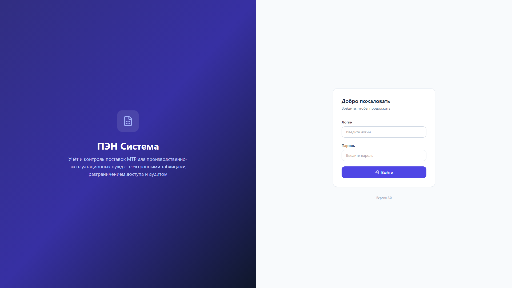 | 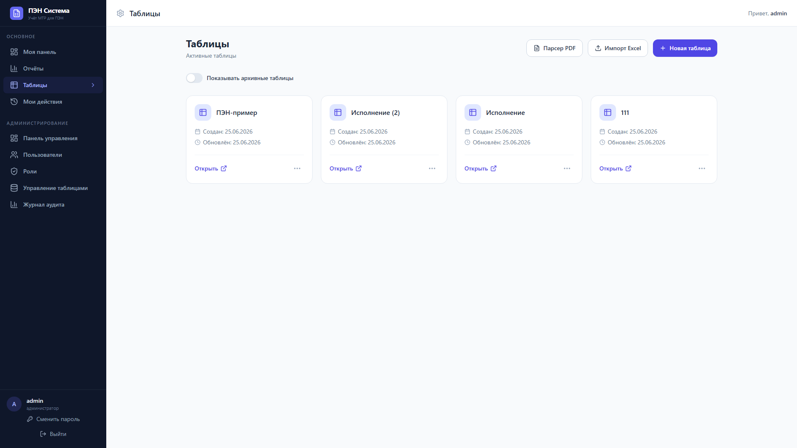 |
| *Авторизация* | *Датасеты* |
| 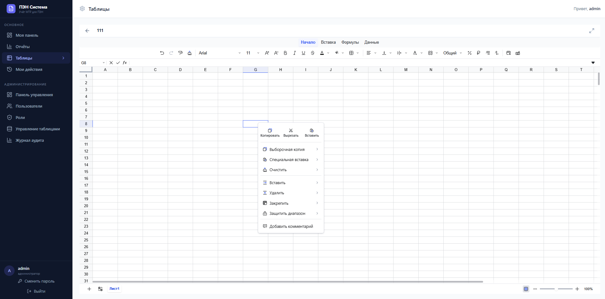 | 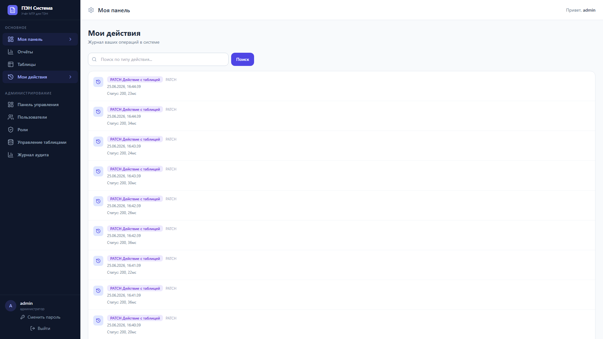 |
| *Редактор таблиц* | *Моя активность* |
| 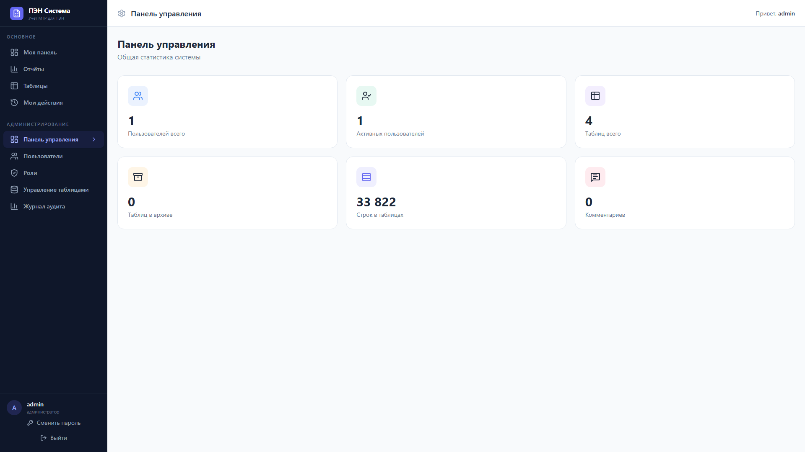 | 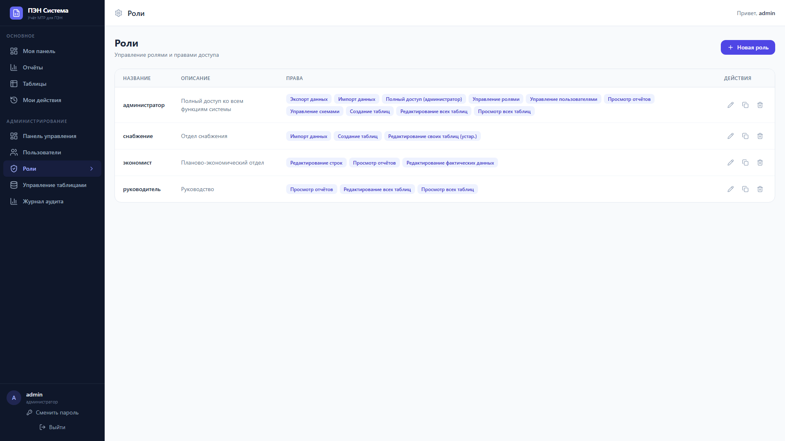 |
| *Администрирование* | *Управление ролями* |
| 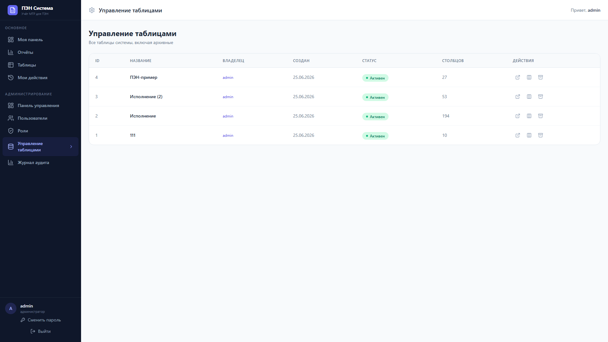 | 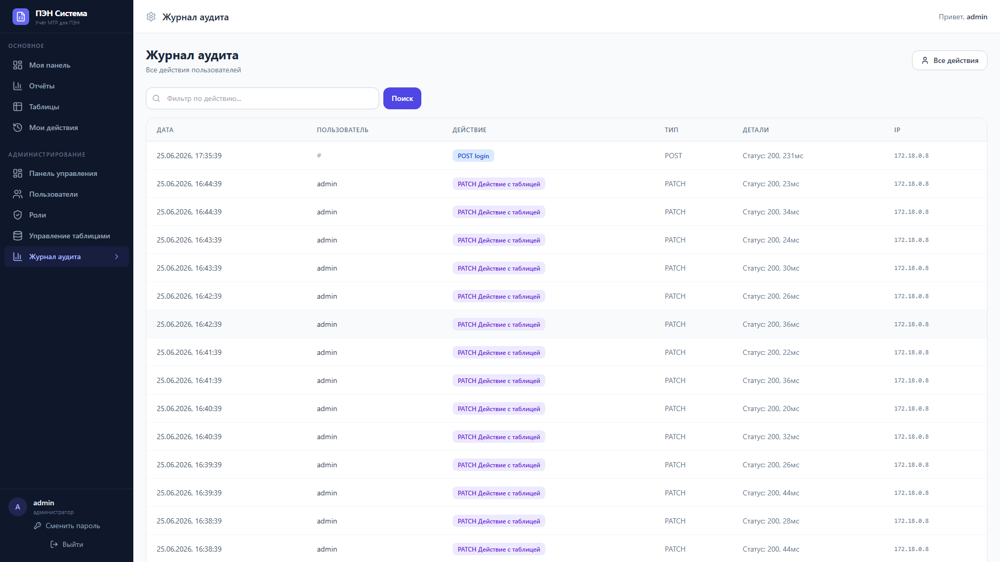 |
| *Датасеты в админке* | *Аудит* |
| 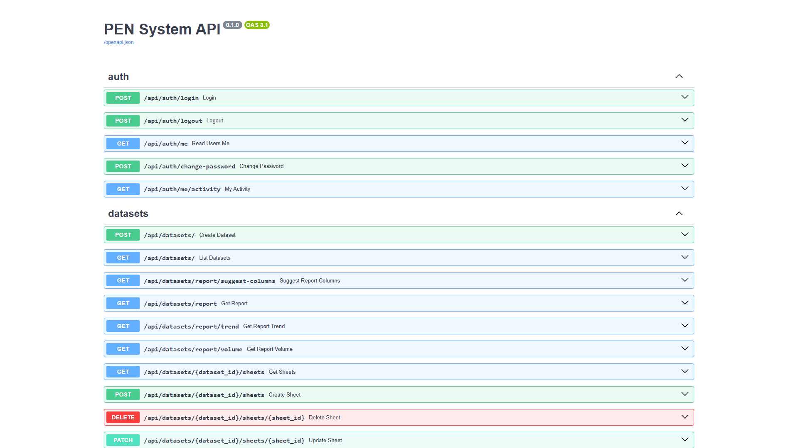 | 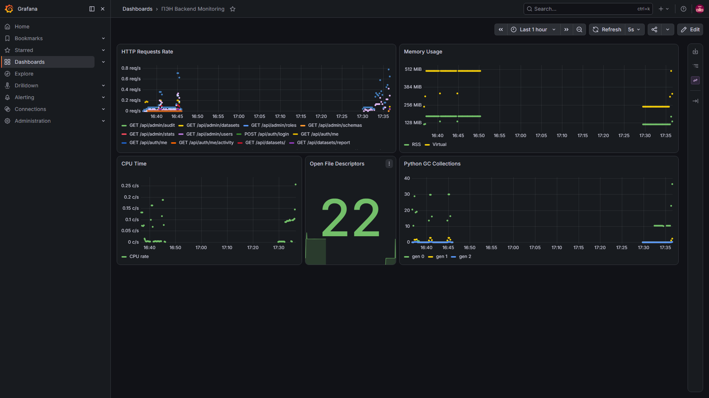 |
| *Swagger-документация* | *Мониторинг (Grafana)* |
| 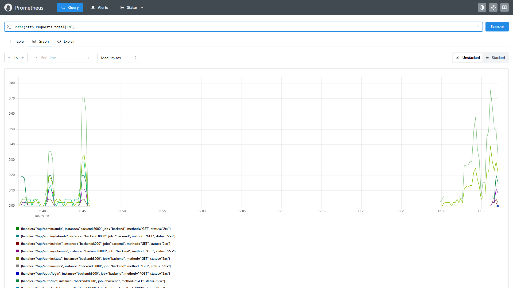 | |
| *Мониторинг (Prometheus)* | |

</details>

## Быстрый старт

```bash
git clone https://github.com/bylbozator/pen-system-02.git
cd pen-system-02
cp .env.example .env   # задайте SECRET_KEY, пароли БД/Redis и ADMIN_PASSWORD
docker-compose up -d
```

| Сервис | Адрес |
|---|---|
| Фронтенд | http://localhost |
| API (Swagger) | http://localhost:8000/docs |
| Grafana | http://localhost:3000 |
| Prometheus | http://localhost:9090 |

> [!NOTE]
> Учётная запись по умолчанию задаётся переменными `ADMIN_USERNAME` / `ADMIN_PASSWORD`
> в `.env` (см. [.env.example](.env.example)). Не используйте значения по умолчанию вне локальной разработки.

## Структура проекта

```
pen-system-02/
├── backend/                  # FastAPI + SQLAlchemy + Celery
│   ├── app/
│   │   ├── routers/          # REST-эндпоинты (auth, datasets, rows, admin, …)
│   │   ├── services/         # импорт/экспорт Excel, парсинг PDF, валидация
│   │   ├── tasks/            # фоновые задачи Celery
│   │   ├── middleware/       # аудит действий, CSRF-защита
│   │   └── migrations/       # Alembic-миграции
│   └── Dockerfile
├── frontend/                 # React 18 + TypeScript + Vite + Tailwind
│   └── src/
│       ├── components/       # страницы и UI-компоненты
│       ├── hooks/            # переиспользуемые хуки
│       ├── contexts/         # AuthContext
│       └── utils/            # работа с формулами, комментариями, аудитом
├── prometheus/               # конфигурация Prometheus
├── grafana/provisioning/     # дашборды и датасource «из коробки»
├── screenshots/              # скриншоты интерфейса
├── docker-compose.yml        # оркестрация всех сервисов
└── .env.example              # шаблон переменных окружения
```

## Переменные окружения (.env)

Скопируйте `.env.example` в `.env` и отредактируйте:

| Переменная | Назначение | По умолчанию |
|---|---|---|
| `POSTGRES_USER` / `POSTGRES_PASSWORD` / `POSTGRES_DB` | База данных | pen / pen / pen |
| `SECRET_KEY` | Ключ подписи JWT | — |
| `REDIS_PASSWORD` | Пароль Redis | — |
| `GRAFANA_PASSWORD` | Пароль администратора Grafana | admin |

## API

Swagger-документация автоматически генерируется FastAPI:

- http://localhost:8000/docs (Swagger UI)
- http://localhost:8000/redoc (ReDoc)

Основные эндпоинты:

| Метод | Путь | Назначение |
|---|---|---|
| POST | `/api/auth/login` | Аутентификация |
| GET | `/api/datasets` | Список датасетов |
| POST | `/api/datasets` | Создать датасет |
| GET | `/api/datasets/{id}` | Датасет со строками |
| PUT | `/api/datasets/{id}/rows/{row_id}` | Обновить строку |
| POST | `/api/import-export/import` | Импорт файла |
| GET | `/api/admin/users` | Управление пользователями (admin) |
| GET | `/api/admin/audit` | Лог аудита (admin) |
| GET | `/metrics` | Prometheus-метрики |

## Разработка

### Запуск без Docker

**Бэкенд:**
```bash
cd backend
pip install -r requirements.txt
uvicorn app.main:app --reload --port 8000
```

**Фронтенд:**
```bash
cd frontend
pnpm install
pnpm dev
```

### Миграции БД
```bash
cd backend
alembic upgrade head
```

### Тесты
```bash
# E2E (Playwright)
cd frontend
pnpm exec playwright test
```
